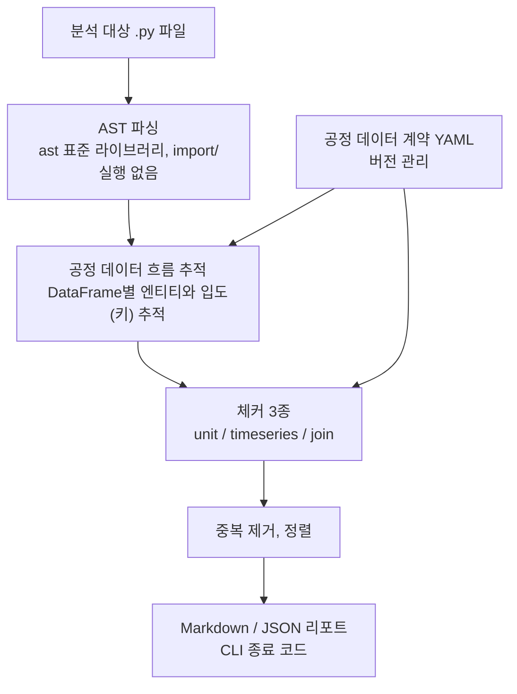

<div align="center">


<h2>fab-review (반도체 공정 데이터 정합성 검증 CLI)</h2>
<p>pandas 공정 데이터 코드가 물리량, 시간, 계보 불변 조건을 깨는 지점을 정적 분석으로 찾아냅니다</p>

<p><a href="#quick-start">Quick Start</a> | <a href="#install">Install</a> | <a href="#pipeline">Pipeline</a> | <a href="#cli-usage">CLI</a> | <a href="#detection-rules">Rules</a> | <a href="#process-data-contract">Contract</a> | <a href="#scope">Scope</a></p>

</div>

---

## Overview

반도체 fab의 SPC 관리도, FDC 룰, 수율 리포트는 결국 누군가가 짠 pandas 스크립트를 거쳐 나옵니다. 이 스크립트가 아래 세 가지를 틀리면 **에러 없이 실행되고, 조용히 틀린 숫자만** 만듭니다.

| 불변 조건 | 예시로 깨지는 방식 |
|---|---|
| **물리량(단위)** | 장비 A는 mTorr, 장비 B는 Pa로 로깅된 압력을 단위 변환 없이 합쳐서 관리한계를 계산 |
| **시간(센서 정렬)** | 샘플링 주기가 다른 두 센서를 timestamp 정확 일치로 병합하면 대부분의 행이 조용히 사라짐 |
| **계보(로트/웨이퍼 입도)** | 웨이퍼 단위 테이블을 `lot_id`만으로 조인하면 행이 곱해지고, 표본 계측과 inner join하면 미측정 웨이퍼가 사라짐 |

`fab-review`는 코드를 **실행하지 않고** `ast`로만 읽어서, 이 세 가지가 깨지는 지점을 찾아 사람이 읽을 수 있는 리포트로 알려줍니다. 판정 기준은 팀이 작성하는 **공정 데이터 계약**(`contracts/contract.yaml`)이라, 코드를 고치지 않고 계약만 바꿔도 fab, 장비별 규칙을 조정할 수 있습니다.

> [!NOTE]
> 하지 않는 것: 코드 자동 수정, 설비 제어, LLM 호출, 실제 fab 데이터 접근. 배경과 전체 로드맵은 [`docs/design.md`](docs/design.md)를 참고하세요.

---

## Quick Start

```bash
# 1) 저장소에 포함된 데모 스크립트 4개(버그 3개 + 정상 1개)를 검사
fab-review check samples/ --contract contracts/contract.yaml --format md --out report.md

# 또는 모듈로 실행
python -m fab_review check samples/ --contract contracts/contract.yaml
```

버그가 있는 3개 스크립트에서 각각 규칙이 `error`로 잡히고, 정상 스크립트는 0건이 나옵니다.

```text
# fab-review 리포트

계약 버전: `0.1.0`
error 4건, info 0건

## [ERROR] FAB-J001 — 조인 입도 키 누락 (규칙, contract 0.1.0)

`samples/bug_join.py:16`

wafer 입도와 metrology 입도를 조인하는데, 공통 조상(wafer) 입도의 키
['lot_id', 'wafer_id'] 중 ['wafer_id']가 조인 키에서 빠졌습니다. ...

제안: 누락된 키를 조인 키에 추가하거나, 먼저 공통 조상 입도로 집계한 뒤
      전체 키로 조인하세요 (필요하면 how='left'+validate+indicator 사용).
```

네트워크나 LLM 호출 없이 전부 로컬에서 실행되며, 같은 입력이면 항상 같은 결과가 나옵니다.

---

## Install

```bash
python -m pip install -e ".[dev]"
```

> [!IMPORTANT]
> Python 3.11 이상이 필요합니다.

---

## Pipeline



---

## Project architecture

```text
fab-review/
├─ contracts/contract.yaml   # 공정 데이터 계약
├─ fab_review/
│  ├─ contract/              # 계약 스키마, 로더, 패턴 매처
│  ├─ analysis/              # AST 파서, 흐름 추적기, merge 해석기
│  ├─ checkers/              # unit.py, timeseries.py, join.py, catalog.py
│  ├─ report/                # markdown.py, json_report.py
│  ├─ models.py              # Finding 모델
│  └─ cli.py                 # CLI 진입점
├─ synth/generate.py         # 고정 시드 합성 데이터 생성기
├─ samples/                  # 데모 스크립트(버그 3개 + 정상 1개) + 합성 데이터
└─ tests/                    # pytest (109개, 규칙마다 양성/음성 포함)
```

---

## CLI usage

```bash
fab-review check <경로> --contract <계약.yaml> [--format md|json] [--out <파일>]
```

| 옵션 | 설명 |
|---|---|
| `<경로>` | 분석할 `.py` 파일 또는 디렉토리(하위 디렉토리까지 재귀 탐색) |
| `--contract` | 공정 데이터 계약 YAML 경로 (필수) |
| `--format` | `md`(기본) 또는 `json` |
| `--out` | 리포트를 파일로 저장. 생략하면 표준출력 |

### 종료 코드

| 코드 | 의미 |
|---|---|
| `0` | error 없음 (info는 있을 수 있음) |
| `1` | error 1건 이상 |
| `2` | 도구 오류: 계약 로딩 실패, 입력 경로 없음 등 |

> [!NOTE]
> 대상 코드에 실제 파이썬 구문 오류가 있으면 CLI 전체를 중단하지 않고, 그 파일만 `info` 등급으로 표시한 뒤 나머지 파일 분석을 계속합니다.

---

## Detection rules

| 규칙 ID | 지키는 불변 조건 | error 조건 | info로 낮추는 경우 |
|---|---|---|---|
| `FAB-U001` | 물리량(단위) | 같은 물리량 family인데 단위 토큰이 다른 값끼리 산술, 비교, concat | 단위 토큰이 모호하거나 없음 |
| `FAB-T001` | 시간(센서 정렬) | 샘플링 주기가 다른 `time` 입도 엔티티끼리 timestamp 정확 일치 merge | 센서, 주기를 알 수 없음 |
| `FAB-J001` | 계보(입도) | 조인 키가 두 엔티티의 공통 조상 입도의 키를 모두 포함하지 않음 | 엔티티를 알 수 없음, `df.join()` 사용 |
| `FAB-J002` | 계보(커버리지) | `coverage: sampled` 엔티티와 `how` 생략(암묵적 inner) 조인 | `how="inner"`를 명시적으로 지정함 |

각 규칙의 상세 설명, 예시, 수정 제안 템플릿은 [`fab_review/checkers/catalog.py`](fab_review/checkers/catalog.py)에 있습니다.

---

## Process data contract

판단 기준이 되는 도메인 지식은 코드가 아니라 버전 관리되는 YAML(`contracts/contract.yaml`)에 있습니다. 핵심 구성은 다음과 같습니다.

```yaml
contract_version: "0.1.0"

unit_families:                    # 물리량별 허용 단위
  pressure: [mTorr, Torr, Pa]

entities:                         # 공정 엔티티의 키, 입도, 부모 관계
  wafer:
    key: [lot_id, wafer_id]
    grain: wafer
    parent: lot
  metrology:
    key: [lot_id, wafer_id, site_id]
    grain: site
    parent: wafer
    coverage: sampled              # 표본 웨이퍼, 사이트만 측정

sources:                          # 파일명 패턴 -> 엔티티(+센서)
  - { pattern: "fdc_rf_*", entity: fdc_trace, sensor: rf_power }

sensors:                          # 센서별 샘플링 주기 (FAB-T001 판정용)
  rf_power: { sampling_period: "1s" }
```

`sensors`, `sources[].sensor`, `entities[].parent`는 설계서 원안을 판정에 꼭 필요한 만큼만 최소로 확장한 부분입니다.

> [!WARNING]
> 계약 안의 구체적인 수치(샘플링 주기, 로트당 웨이퍼 수 등)는 전부 `# 예시 값 — 도메인 팀 검증 필요` 주석이 달려 있으며, [`docs/progress.md`](docs/progress.md)에도 누적 기록되어 있습니다. 실제 fab 값으로 아직 검증되지 않았다는 뜻입니다.

---

## Testing

```bash
python -m pytest -q
```

규칙마다 최소 양성 1개, 음성 1개 테스트가 있고, CLI는 실제 프로세스를 띄워 end-to-end로도 검증합니다(`tests/test_cli_e2e.py`). 같은 입력을 반복 실행해 결과가 바이트 단위로 동일한지까지 확인합니다.

---

## Scope

`docs/checklist.md`의 0~5절, **"첫 데모 체크포인트"까지 완료**된 프로토타입입니다.

| 구분 | 내용 |
|---|---|
| 있음 | 계약 로딩, AST 흐름 추적, 체커 3종(unit/timeseries/join), Markdown/JSON 리포트, CLI |
| 아직 없음 | LLM 문맥 판단, FastAPI, SQLite 저장소, GitHub/Slack 연동, PR diff 입력, 억제 주석, SARIF, `pint` 기반 단위 검증 |

각 단계의 상세 진행 기록과 설계서 대비 변경/가정 사항은 [`docs/progress.md`](docs/progress.md)에 있습니다.

---

## Docs

| 문서 | 내용 |
|---|---|
| [`docs/design.md`](docs/design.md) | 최종 설계서 (배경, 검증 계획, 8주 로드맵) |
| [`docs/checklist.md`](docs/checklist.md) | 구현 체크리스트 |
| [`docs/progress.md`](docs/progress.md) | Stage별 진행 보고 |
| [`CLAUDE.md`](CLAUDE.md) | 이 저장소에서 작업할 때의 범위, 원칙, 규칙 |

---

## Team

**GOAT** (Gachon Oriented AI Transformation) — 대학 연합 AI 직무 프로젝트(U3 AI 직무 코어) 6인 팀. 백엔드/보안 전공 1인과 반도체, 신소재, 기계공학, 산업공학 배경 5인으로 구성되어 있습니다.

## License

[MIT](LICENSE)

---

<div align="center">
개선 제안과 이슈를 환영합니다.
</div>
